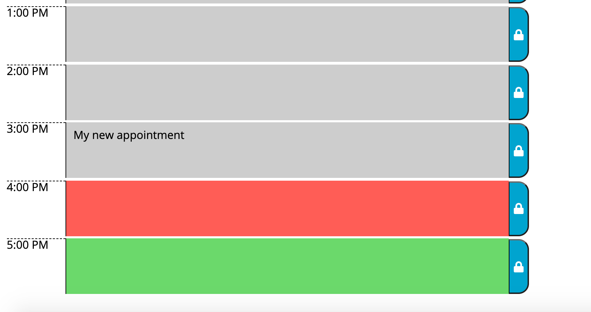

# Susan Fujii's Work Day Scheduler

## Table of Contents

- [Description](#Description)
- [Motivation](#Motivation)
- [Why I Built This](#Why-I-Built-This)
- [What I Learned](#What-I-Learned)
- [Installation](#Installation)
- [Usage](#Usage)
- [Screenshots](#Screenshots)
- [Credits](#Credits)
- [License](#License)
- [Features](#Features)
- [Contribute](#How-to-Contribute)

## Description

This is a simple calendar application that allows a user to save events for each hour of the day. It runs in the browser and features dynamically updated HTML and CSS powered by jQuery. This project also uses the Moment.js library to work with date and time and to color the time blocks according to whether they occurred in the past, in the future, or right now.

### Motivation

Employees often have busy schedules and need a quick, at-a-glance color-coded app where they can add important events to help them manage their time more effectively. 

### Why I Built This

This was a great project to begin to understand the differences between Bootstrap (tables vs. grid), and traditional CSS Grid / Flexbox styling. It was also fun to work with Moment.js to see its capabilities and to determine which time blocks occurred in the past, present, and future.

### What I Learned

This was a fun project! It required a bit of logic, a lot of design considerations, working with the DOM (using JQuery to dynamically paint colors and appointments to the DOM), looping, working with event listeners, saving/retrieving from localStorage, and much more.

## Installation
To view this project, simply visit (https://srfujii.github.io/Work_Day_Scheduler/index.html)
 
To install this project on your local machine, simply visit this repo at (https://github.com/srfujii/Work_Day_Scheduler) and use git to clone it to your local environment.

## Usage
This app is pretty self-explanatory-- users can view their day planner in hour-long blocks of time, and enter/update appointments as they so choose. To save an appointment, the user simply types in the corresponding hour time block and clicks the save button next to it to save the new appointment to local storage. The appointment is preserved even if the user refreshes his/her page. Additionally, users are alerted that they cannot enter empty appointments. Previous appointments are displayed as well. 

## Screenshots
Here are some screenshots for you to preview how the work day scheduler looks and feels:

### Quiz Game UI:

## Credits

1. [Rice Technology Bootcamp](https://techbootcamps.rice.edu/)

### Resources:

1. [CSS Tricks: Be Slightly Careful with Sub-Elements of Clickable Things](https://css-tricks.com/slightly-careful-sub-elements-clickable-things/)
2. [Insert Text into Textarea with JQuery](https://stackoverflow.com/questions/946534/insert-text-into-textarea-with-jquery)
3. [FontAwesome Lock Image for Save Button](https://fontawesome.com/icons/lock?style=solid)
4. [JQuery Crash Course: Traversy Media](https://www.youtube.com/watch?v=VlWsJHsVb-E&list=PLillGF-RfqbYJVXBgZ_nA7FTAAEpp_IAc&index=2)
5. [JavaScript ParseInt Function](https://www.w3schools.com/jsref/jsref_parseint.asp)
6. [Moment.js](https://momentjs.com/docs/#/displaying/)
7. [BootStrap](https://getbootstrap.com/docs/5.0/content/tables/)

## License
[MIT License](./license.txt)

## Features

<ol>
    <li>Semantic HTML implemented in HTML and CSS</li>
    <li>ELements follow logical structure</li>
    <li>Comments added before each CSS element and HTML section</li>
    <li>All buttons and links work</li>
    <li>Title is concise and descriptive</li>
    <li>Current Date is displayed at top of calendar</li>
    <li>Timeblocks are displayed for each standard business hour</li>
    <li>Each timeblock is color coded to indicate whether it is in the past, present, or future</li>
    <li>When user clicks into a timeblock he/she can enter an event</li>
    <li>When user clicks the save button for that timeblock the text for that event is saved in local storage</li>
    <li>If the user refreshes the page, the saved events persist</li>
    <li>App alerts user if he/she tries to save an empty event</li>
</ol>

## How to Contribute

